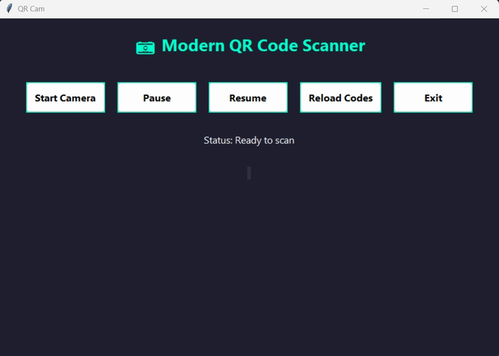
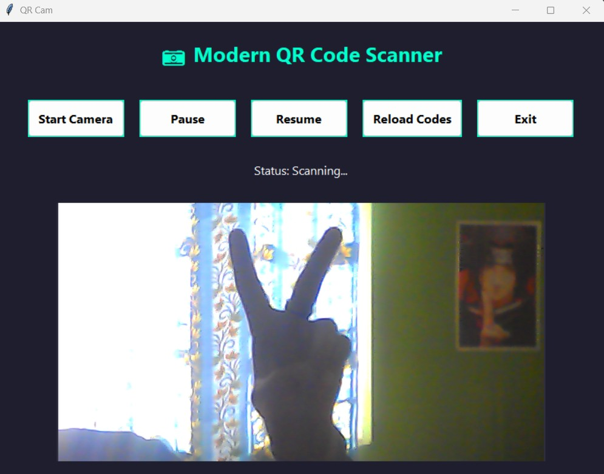
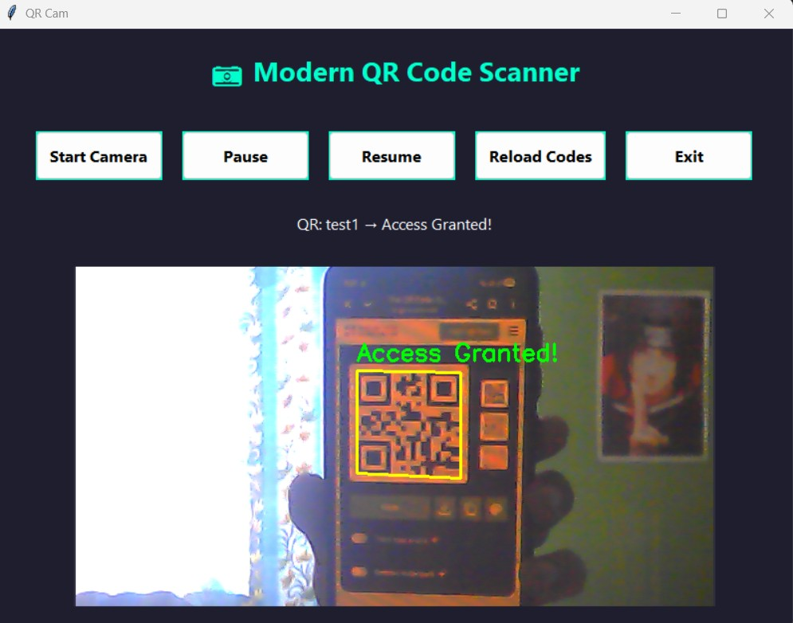

# 🎥 Modern QR Code Scanner (QR Cam)

[](https://www.python.org/)
[](https://opencv.org/)
[]()
[](LICENSE)
[]()

---

### 🚀 Overview

**QR Cam** is a modern, lightweight, and visually appealing **QR Code Scanner** built using **Python 3.14**, featuring a sleek dark-themed GUI, real-time camera scanning, and access verification through a simple `codes.txt` file.

Whether you’re scanning for security, access control, or fun — this tool makes it simple, fast, and beautiful.

---

## ✨ Features

- 📸 **Live Camera Scanning** — Real-time QR detection using your webcam.  
- ✅ **Access Verification** — Instantly checks QR data against a customizable list in `codes.txt`.  
- 🔁 **Reload Codes Anytime** — Reload updated codes without restarting the program.  
- ⏸️ **Pause & Resume Camera** — Control scanning with simple buttons.  
- 💬 **Status Display** — Live updates show what’s happening in real time.  
- 🧩 **Modern GUI** — Dark theme, smooth visuals, and responsive layout built with `Tkinter`.  
- ⚡ **Fast and Efficient** — Uses threading for lag-free performance.  
- 🛠️ **Easy to Customize** — Modify fonts, colors, and layout directly in `create_ui()`.

---

## 🖼️ Screenshots


| Home Screen | Scanning Mode | Access Granted |
|--------------|---------------|----------------|
|  |  |  |

---

## 🧠 How It Works

1. The app loads **allowed QR codes** from `codes.txt`.  
2. Your webcam opens and begins scanning frames in real time.  
3. When a QR code is detected:
   - If it matches an entry in `codes.txt` → 🟢 **Access Granted!**
   - Otherwise → 🔴 **Access Denied!**
4. You can **pause**, **resume**, or **reload** code lists without restarting.

---

## ⚙️ Installation

### 🧩 Step 1 — Clone the Repository
```bash
git clone https://github.com/Kreative21/qrcode-scanner.git
```


### 🐍 Step 2 — Install Python
Download and install Python 3.14 (or newer) from the official [Python website](https://www.python.org/downloads/)

During installation:

✅ Check “Add Python to PATH” <br>
✅ Ensure pip is installed

To verify installation:
```bash
python --version
```

You should see:
`Python x.xx.x (Your Version)`


### 📦 Step 3 — Install Dependencies
Install the required Python libraries:
```bash
pip install opencv-python pillow
```


### 🧾 Step 4 — Create the Codes File
Edit the data in the file named `codes.txt` in the same folder as main.py and add your allowed codes separated by commas:

`12345, 67890, HELLO-WORLD`


### ▶️ Step 5 — Run the Application

Launch the app with:

```bash
python main.py
```

You’ll see the window open with:

`[ Start Camera ] [ Pause ] [ Resume ] [ Reload Codes ] [ Exit ]` <br>
`Status: Ready to scan`

---

# 🙌 Credits

👨‍💻 Developer: Ronak (aka L)

🧠 Concept & Design: Inspired by modern access control systems <br>
💻 Built with: Python, OpenCV, Tkinter, and Pillow <br>
🎨 UI Theme: Dark Theme

---

# ⭐ Support & Feedback

If you like this project, please ⭐ star this repo on GitHub — it helps a lot! <br>
Got ideas or suggestions? <br>
👉 Feel free to open an issue or submit a pull request.
